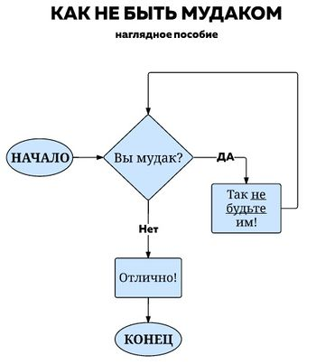

* [Основные правила](#основные-правила)
* [Правила персонажа](#правила-персонажа)
* [Особые положения для некоторых ролей](#особые-положения-для-некоторых-ролей)
  * [Главы](#главы)
  * [Офицеры Службы Безопасности](#офицеры-службы-безопасности)
  * [Синтеты](#синтеты)
  * [Антагонисты](#антагонисты)
* [О преступлении и наказании](#о-преступлении-и-наказании)
* [И еще немного об административных действиях](#и-еще-немного-об-административных-действиях)

## Основные правила

**0. Don’t be a dick  
_Не будь мудаком. Это основное правило поведения в любом обществе. Если бы все люди следовали ему, большинство других правил поведения были бы не нужны._**

1. Придерживайтесь норм общения  
   - Соблюдайте нормы русского языка - пишите грамотно. 
     - Слэнг борд, лурка и иже с ними лучше оставить там же. 
     - Ненормативная лексика в OOC каналах не приветствуется.  
   - Уважайте других участников сообщества.  
      - Под это правило подпадает эскалация спора с переходом на личности и оскорбления. Пишите взвешенно и аргументированно.  
      - В том числе и новичков. Они, вполне вероятно, могут огорчить вас даже не желая этого. Проявите понимание.  
   - Спам запрещен.  
   - Под запретом так же политические и религиозные дебаты, так как являются слишком конфликтными темами. Оставьте это для специализированных форумов. Вы ведь пришли сюда играть в 2д-космонавтов, не так ли?  

2. Поведение, направленное на намеренное причинение вреда другим игрокам без малейших на то игровых оснований, не приветствуется, вплоть до выдачи перманентной блокировки без лишних разговоров

3. Метагейминг (metagame) - использование во время игры информации, полученной не игровым путем (из любого OOC источника), серьезно вредит игровой атмосфере, и потому запрещен. Сюда относится игра с использованием сторонних чатов (голосовых или текстовых) для кооперации действий.
Ваш персонаж не должен мчаться спасать друга на другой стороне станции, если персонаж (а не вы) не знает об этом. Или готовится к определенному режиму игры без явных к этому IC-предпосылок.
   -  Исключение - вам хочется показать кому-то из своих знакомых эту игру, при этом попутно объясняя происходящее. В таком случае, предварительно обратитесь к администраторам. Это вполне допустимо, но во избежание недоразумений лучше предупредить. К тому же, администраторы могут вам помочь, даже отправить в не игровую зону станции.
    - Стоит учитывать некоторые игровые условности касательно знаний **персонажа** о мире игры. По умолчанию, большинство информации об антагонистах считается неизвестной для экипажа. Подробнее можно посмотреть в [данной статье на вики](https://wiki.taucetistation.org/Identifying_Antagonists).
   
4. Распространение информации о текущем раунде посредством OOC средств запрещено. Сюда попадает как игровой OOC канал чата, так и любые сторонние форумы/чаты и прочие средства общения. Информация и ее распространение в игре является одним их тех элементов, что делает многие раунды интересными. Внезапные предательства, обман, блеф и прочее. А потому, преждевременное ее обсуждение вне рамок раунда - может испортить интригу и впечатление от игры.  
   - Если у вас возникли какие-то проблемы с механикой - напишите менторам (кнопка F9). Если вы считаете, что обнаружили баг - напишите Администраторам (F1). Если вы уверены что нашли баг - можете написать о нем сразу на гитхаб.
Если вы считаете что кто-то делает что-то не-так, можете попробовать написать ему в LOOC (локальный OOC чат, который отображается только у администраторов и тех, кто находится в данный момент рядом с вами), либо попросить Администратора подсказать человеку, в чем он не прав.  
   - Написание жалобы по раунду на форум или в дискорд так же стоит отложить до окончания раунда.  
   - По указанной выше причине мы не можем разрешить стриминг раундов без предварительного согласования. Однако, если вам очень хочется этим заниматься - напишите нам. Мы можем что-нибудь придумать.  
   - Это, однако, не относится к записи своей игры на сервере. Главное, чтобы эти записи попадали в общий доступ уже после окончания раунда.  

4. Пауэргейминг (powergaming, powerplay) - стремление любыми способами “победить в игре”, не приветствуется. Как правило, данное поведение характеризуется приоритезацией получения различных игромеханических преимуществ для себя, в ущерб удовольствию, получаемому от игры другими игроками и/или созданию интересных игровых ситуаций.  
   - Сюда же относится манчкинизм - стремление снарядить своего персонажа на все случаи жизни, не учитывая конкретной ситуации.     
   - Особо стоит отметить намеренное использование багов и недоработок игры для своей пользы. Лучше сообщите о них на гитхаб.
   - Также запрещенно использование каких-либо видов стороннего программного обеспечения: скрипты, макросы и читы.

5. Прямое и намеренное нарушение атмосферы игры запрещено.  
   - Да, на дворе 26 век, и ваш персонаж вполне может знать о событиях на земле 21-го века, но это совершенно не повод начинать орать имена известных политических деятелей того периода в радио. Или привносить любую другую информацию из сторонних источников в игру. В особенности, если оно ну совсем не вписывается в картину космической станции на задворках далекого будущего  
     - Есть небольшое исключение. Вы можете обмениваться ссылками на какую-нибудь музыку через ПДА, в случае если вы замените название сайта на что-то более подходящее для этой вселенной (тот же wetskrells.nt). О деталях можете договориться в LOOC. Прямое использование ссылок без изменений все так же остается под запретом.  

6. Запрещено распространять личные данные других участников сообщества без их на то согласия (фото, профили соц сетей).

7. Запрещена реклама сторонних серверов без согласования с администрацией. Вы можете свободно обсуждать сторонние сервера, но предоставлять информацию о конкретном сервере можно только на форуме. Под запретом так же любая коммерческая реклама. 

8. Порнографический или любой другой NSFW ("Not Safe For Work" или "не безопасный для работы" - не приемлемый в приличном обществе) контент под запретом в OOC каналах.

9. Игра предназначена для лиц старше 16 лет. Если ваш возраст не соответствует - немедленно покиньте игру!

10. Запрещено использовать более одного аккаунта byond для игры на сервере.   
    > В случае, если вы по тем или иным причинам решили сменить аккаунт - сообщите об этом администрации. При этом старый аккаунт будет заблокирован на этом сервере.

## Правила персонажа

0.1 Каким бы персонажем вы бы не решили играть - помните, если ваше удовольствие будет достигаться ценой раздражения окружающих - это не хорошо. А потому - старайтесь держать себя в руках. Конфликты - это хорошо, но лишь когда они осмыслены и развиваются постепенно.

##### Старайтесь, чтобы персонаж, за которого вы играете, был хоть в какой-то мере правдоподобен.
 
1. Используйте реалистичные имена, в случае игры за ксеноса используйте имена в соответствии с лором игры.
   - Ступиднейм - имя, нарушающее пункт правил об атмосфере игры. Это может быть имя какой-то известной личности, имя с  добавлением туда непонятных “кличек”, либо просто что-то достаточно глупое. Рекомендуется избегать подобных имен. В случае, если вам очень хочется как-то назвать своего персонажа, но у вас есть сомнения, - обратитесь к Администратору.   
      - Имя известной личности с минимальными изменениями в духе замены одной буквы, перестановки местами фамилии и имени и тому подобным - все так же является ступиднеймом. Нет, нам не нужны Алексеи Овальные на станции.   
   - Некоторые роли и позиции предоставляют вам возможность выбрать имя (кличку, позывной) уже в процессе раунда. К ним, зачастую, в этом плане применяются более легкие требования, однако, прямые оскорбления и OOC контент всё так же под запретом.
   - Отдельно стоит отметить, что отсылки в подобных именах к другим участникам сообщества так же нарушают атмосферу, поэтому их следует избегать. 
    - В связи с проблемой отображения имен персонажей на кирилице, используйте латиницу!

2. Уважайте такие понятия как “адекватная эскалация конфликта” и “мотивация”.  
И потому, старайтесь не сводить решение любой проблемы к устранению противоборствующей стороны. Подробнее об убийствах можете почитать [тут](https://wiki.taucetistation.org/Убийства).

3. Уважайте цепь командования. Помните, вы - команда станции. А главы - лидеры этой команды. Для того, чтобы послать куда подальше прямого начальника, от которого зависит ваше дальнейшее трудоустройство - неплохо бы иметь хоть какую-то причину.

4. Старайтесь не наделять своего персонажа абсолютными знаниями и умениями. Да, механика игры мало в чем ограничивает вас, если вы ее хорошо знаете, но это далеко не всегда является поводом.  
   - За правило можно принять следующее - если на станции есть кто-то кто должен заниматься конкретной работой - не стоит выполнять эту работу за него. Вламываться на кухню при живом поваре, чинить плитку при живых инженерах, идти воевать при живых офицерах и так далее.  
   - Как показывает практика - выполнение своей роли в большинстве случаев намного важнее чем попытки брать на себя чужую. Тот же врач будет намного полезнее, если сможет вытащить с того света пару офицеров, вместо того чтобы идти воевать и погибнуть от шальной пули.   

5. Флавор существует сугубо для описания внешности персонажа. Нет, серьезно. Не стоит писать туда историю получения воон того шрама. Или описывать характер персонажа. Даже если очень хочется. Ведь другим будет намного интереснее узнать это всё от вашего персонажа, а не просто прочитать где-то. 

6. Любой отыгрыш эротическо-порнографического характера (ERP) на данном сервере запрещен.

7. Если игра не выдала вам роль антагониста - вы не являетесь им. Ваша мама не генокрад, ваш отец не офицер отряда смерти, и вы не занимаетесь тем, что между чашками кофе продаете биологическое оружие на сторону. А если и занимаетесь то уж точно не станете говорить об этом никому на станции, правда ведь? Это, впрочем, не запрещает вам быть коррумпированным главой/офицером, красть, заниматься мелкими грабежами и тому подобным. Однако, следует придерживаться некоторых рамок. В общем случае правило следующее - целью ваших действий не должно быть что-то что выльется в вывод из игры другого игрока. Вашей целью не должны быть предметы высокого риска и некоторые уникальные предметы, отсутствие которых может сказаться на развитии раунда. Если вас застукали - вы не должны эскалировать ситуацию. Помимо этого, хорошим тоном будет предварительно уведомить Администрацию о своих намерениях.

8. Отыгрыш персонажа, принадлежащего к какой-либо ксенорасе, должен учитывать особенности ее лора. 
   - Создавая персонажа ксенорасы (не-человека) вы обязаны как минимум знать изложенную на вики информацию об этой расе. Если вы пренебрежете этим правилом - доступ к данной расе (а если речь идет о ксеносах, полученных за время - то ко всем расам, полученным данным образом) вам закроют. 

9. В процессе раунда некоторые ситуации сказываются на поведения вашего персонажа. Зачастую это связанно с той или иной формой "промывки мозгов". Пожалуйста, отыгрывайте данные изменения корректно (примите то, что ваша роль в раунде изменилась и действуйте соответственно).
   - Сюда относится обращение в культ, превращение в трелла, получение контракта от мага, получение импланта лояльности. Если вы сомневаетесь в том, как именно реагировать на тот или иной момент - уточните у Администратора.

10. Воздержитесь от использования не-игровых территорий в процессе игры. Как правило это некие технические зоны, проникновение в которые связано с использованием недоработок игровой механики, etc. Помните - ваш персонаж не знает о существовании этих зон и способе проникновения туда, если обратное не было установлено условиями раунда и/или администратором. 
    - Второй слой карты (ЦК, велосити и базы антагонистов) является не-игровым пространством, за исключением некоторых случаев.    
    - В процессе прибытия вашего персонажа на станцию посредством шатла - доступная зона велосити (та, куда вы можете попасть, не используя дополнительных средств и доступов) считается игровой.  
    - По завершению раунда путем прибытия эвакуационного шатла на ЦК - доступная зона ЦК считается игровой зоной.  
    - Для антагонистов, а также отряда БР, предназначенные им зоны считаются игровыми.   
    - Администратор имеет право изменять статус зон на втором слое на свое усмотрение.  

## Особые положения для некоторых ролей

### Главы

0.2 Главы имеют достаточно серьезное влияние на события, происходящие на станции, как и на раунд в целом. Но вместе с этим, они несут куда большую ответственность за все что происходит. 

1. Глава - это прежде всего руководитель и организатор своего отдела. Это тот человек, который должен из бесформенной массы создать четкую и отлаженную машину. Ну или хотя бы попытаться.  
   - Вы - не ассистент с доступом и знаниями отдела. Роль человека-отдела, бесспорно, привлекательна, но не стоит этим увлекаться.  
   - Это все никоим образом не ограничивает вас в возможности делать все самим, особенно если ситуация того требует.  
2. Ваша задача - обеспечить другим игрокам в отделе работу, а не отбирать ее.  
3. Как от представителя высшего эшелона власти на станции, от вас ожидается куда более уважительное отношение к иерархии приказов и прочему. В конце концов, это тот инструмент, который позволит вам держать ситуацию под контролем. Или скатить в неконтролируемый хаос, если вы начнете им пренебрегать. 
4. Как от главы, от вас ожидается то, что вы будете следовать протоколам и инструкциям Корпорации, которая назначила вас на этот пост и, вероятно, платит вам немалые деньги за работу. Подробнее ознакомиться со стационной бюрократией можно [тут](https://wiki.taucetistation.org/Категория:Бюрократия и процедуры).
5. Учитывайте, что ваши решения могут иметь далеко идущие последствия. При этом, ответственность за отданный приказ несете именно вы, и лишь в меньшей степени тот, кто его исполнит. Потому будьте осмотрительны с формулировками. 

### Офицеры Службы Безопасности

0.3 Офицеры имеют значительное влияние на происходящее в раунде,  выше, чем у многих других играющих, а соответственно, и степень их ответственности на порядок выше. Нередко их влияние сопоставимо с влиянием командного состава.

1. Офицер службы безопасности - дисциплинированный боец, который прошел тщательный отбор. Они являются первым и последним рубежом защиты станции. Силой, которая призвана поддерживать внутренний порядок на борту станции и способствовать сохранению корпоративных интересов, в числе прочего служить их законным представителям, то бишь главам.   
   - Соблюдайте [иерархию приказов](https://wiki.taucetistation.org/Standard_Operating_Procedure#Иерархия_приказов). Постарайтесь максимально ответственно отнестись к выполнению поставленных вам задач.  
2. Первоочередной вашей задачей является поддержание порядка и решение игровых конфликтов игровыми же методами.   
   - Не стоит использовать грубую силу в ситуациях, которые можно разрешить без ее применения. Отдавайте отчет своим действиям.  
   - Соблюдайте [протоколы космического закона](https://wiki.taucetistation.org/Space_Law) и внутренний порядок действий, когда это возможно.  
   - На станции в ваших руках находится исполнительная ветвь власти. Не стоит, однако, использовать ее для того чтобы причинять излишние неудобства другим игрокам. Как пример можно привести намеренное завышение сроков выходящие за границы приличия, приписывание дополнительных статей по "подозрениям", несанкционированные казни, в особенности - казни уже захваченных и помещенных под стражу, немотивированное нанесение тяжелых повреждений уже обезвреженному противнику, etc.  
3. На офицеров также возложена обязанность по защите станции и ее экипажа от угроз.   
   - Да, вы являетесь в некотором роде естественным противовесом антагонистам в раунде, однако, у вас нет никаких условий "победы". В конечном итоге, вашего персонажа все так же заботит своя жизнь и жизни других персонажей на станции.  
4. Думайте. Анализируйте ситуацию. Следование космозакону это хорошее начало, но, далеко не всегда он покрывает все нюансы. К тому же, он всегда остается внутриигровым сводом правил. В конечном счете, принятие решения остается за вами. Однако и ответственность за эти решения ложится на ваши плечи.   
5. Играя на офицерах также не стоит забывать о том, что антагонисты - это такие же игроки как и вы. Они тоже пытаются в какой-то мере создать интересный раунд. А потому, нет смысла рассматривать их как врагов. Скорее как оппонентов. У вас может получиться интересное противостояние, в котором вам выпадет возможность проявить все свои профессиональные навыки. А может и нет. Никто этого не знает. Поэтому, не стоит задаваться целью вывести из раунда кого-то сугубо потому что вы уверены что он является антагонистом. 

### Синтеты

0.4 Ответственность за действия, совершенные при выполнении законов, в большей степени несет тот, кто установил эти законы. Но трактовка остается на ваше усмотрение. Используйте это разумно и постарайтесь чтобы это не стало причиной гибели станции.

1. Основным требованием к игрокам на синтетах является выполнение ими установленных им законов  
   - Вы обязаны выполнять любой набор законов, который вы получите. И зачастую, что туда писать решаете далеко не вы. Так что к этому морально стоит быть готовым.  
2. Набор законов, установленный у ИИ и боргов по умолчанию на начало раунда отличается от остальных тем, что приоритет законов в нем принято считать одинаковым. Это значит что в случае конфликтной ситуации вам необходимо действовать так чтобы не нарушить ни один из законов если возможно, либо - чтобы нарушить минимально возможное количество законов.  
   - На другие наборы это правило не распространяется. В них законы имеют приоритет согласно номеру и при конфликте выполняется закон с наименьшим номером.  
   - Нулевой закон всегда имеет высший приоритет. Ионные и взломанные законы имеют приоритет выше стандартных законов но ниже нулевого. Любые законы добавленные после основного, имеют приоритет в соответствии со своим номером. В этом случае четыре стартовых закона можно рассматривать как один закон из четырех пунктов.  
3. Придерживайтесь той мысли, что вы играете не человека а машину. Будет ли в будущем система открытия дверей материться по поводу или без? Сомнительно. Излишняя эмоциональность зачастую смотрится не столь красиво и интересно, как вам кажется. 

### Антагонисты

0.5 Итак, вам выпала роль послужить причиной возникновения тех самых интересных ситуаций. С этой целью вам, вероятно выделен определенный набор спецсредств, а так же имеются некоторые послабления в правилах. Однако, не стоит это расценивать как лицензию на вывод из игры неугодных просто потому что вам так захотелось.  

1. Антагонисту разрешено убивать или другим образом выводить других игроков из раунда, если это совершается ради выполнения целей антагониста.   
2. На антагониста в меньшей степени распространяются правила, касающиеся внутриигровых знаний персонажа.
   - Для подготовленного агента синдиката, напичканного имплантами биоробота или же ксеноса, занимающегося пожиранием людей и присвоением их личностей на регулярной основе, абсолютно нормально обладание знаниями любой станционной профессии, кем бы они ни были изначально.
   - С другой стороны, массовые, приобретаемые в раунде роли (культисты, треллы, революционеры) как правило получают только свои профильные знания, если они есть.
3. Командные роли действуют вместе ради достижения общей цели.  
   - Прямое и открытое противодействие своей команде - запрещено. Однако ничто не мешает вам попытаться действовать по-своему если у вас возникают разногласия. Единственное - постарайтесь не мешать друг другу.  
4. Не стоит пренебрегать своей ролью, если уж она вам выпала. В конце концов, это игра. И многие приходят сюда именно за этим. Расследования, интриги, предательства, катастрофы и многое другое. Это то что придает раунду движение.  
   - Даже если вы не уверены в своих силах - лучше попробовать сделать хоть что-то.  
5. В исключительных случаях антагонисты могут отклоняться от выполнения своих целей, если это идет на пользу раунду в целом. Помимо этого, способы выполнения этих самых целей антагонист выбирает лично, не забывая, однако, про нулевое правило.  
   - Если у вас возникает какая-то нестандартная идея и вы думаете, что вам не помешала бы помощь в ее реализации - поговорите с Администраторами.  
6. Аналогично пункту 5 требований к офицерам - в ваши задачи, зачастую, не входит физическое уничтожение всех потенциальных угроз на станции. Несомненно, куда проще всех перестрелять, а потом грабить пустую станцию, но, интереса такой процесс не доставляет никому. Поэтому, старайтесь проявить некоторую сознательность, подходя к выполнению своих целей. Убийство всего офицерского состава крайне не приветствуется, ровно как и тотальная зачистка всех углов перед установкой бомбы.   

### О преступлении и наказании

0.6 Администратор несет полную личную ответственность за все свои действия в качестве Администратора. 

1. Слушайте, то что вам говорит Администратор.  
   - Если вас официально попросили что-то прекратить, или наоборот сделать - это имеет силу правила.  
   - Крайне не рекомендуется пытаться оспорить решение Администратора в приватных сообщениях.  
   - В случае пренебрежения этим правилом администрация оставляет за собой право выдать вам наказание вплоть до суточной блокировки ссылаясь на этот пункт.  
   - Главным образом от вас ожидается информация по ситуации и вашей мотивации в том или ином случае.  
2. Решение Администратора в раунде окончательно.  
   - Обжалование через форум и только после окончания раунда.  
3. Администратор выносит решение основываясь на своем опыте, опыте других администраторов, своем взгляде на ситуацию и отношении вовлеченных сторон.  
   - Самоцель принятия Административных мер - разрешение конфликта и улучшение качества игры.  
   - В некоторых случаях наказания может и не быть. Или оно может представлять из себя устное предупреждение.  
4. Баны обходить запрещено. Сюда входит как вариант внутриигрового обхода (попытки устроиться на закрытую вам профессию) так и применение некоторых технических моментов игры (использование дополнительных аккаунтов и прочее). В случае обнаружения подобного, наказание будет куда более строгим, нежели то что было изначально. Вплоть до перманентного бана без возможности обжалования.   
5. Администрация оставляет за собой право переносить баны с других серверов.   
   - По данному правилу переносятся только баны с принадлежащих нам серверов.   
   - Это так же касается официального сервера дискорда и прочих серверов, администрированием которых занимается наша команда.

### И еще немного об административных действиях

0.7 Администратор должен действовать в интересах сообщества. 

1. Администратор имеет право без всяких объяснений выдавать наказания если сочтет нужным.   
2. Администратор имеет право вмешиваться в раунд.  
   - Вмешательство, однако, не должно нарушать игровой логики. Свинья с неба в храме это, конечно, хорошо и весело, но нужно знать чувство меры. К примеру, вмешиваться в идущий конфликт с целью помочь той или иной стороне - плохой тон.  
3. За интерпретацию правил в конкретных раундах отвечают присутствующие администраторы.  

